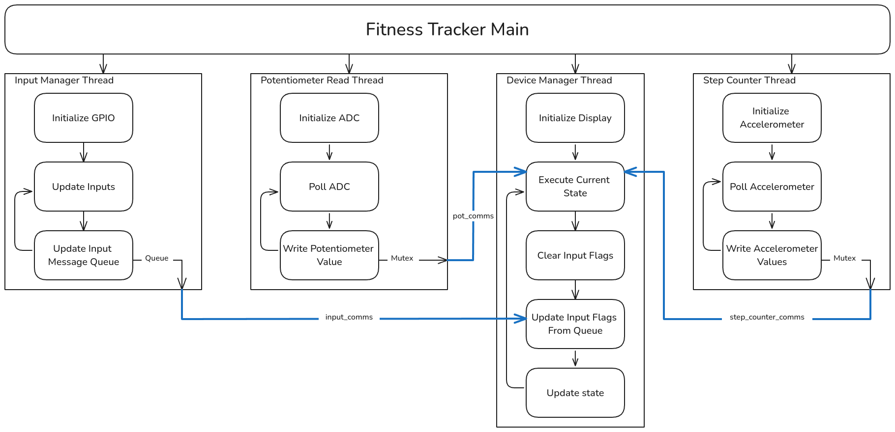
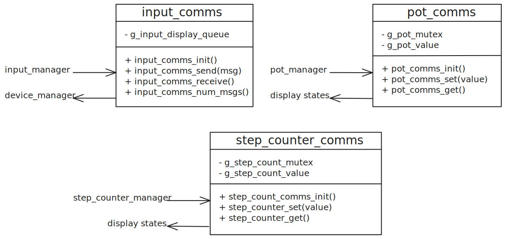

# RTOS Implementation
This project uses a micro kernel architecture to allow concurrency. This reduces
the risk of missed task deadlines, ensuring that more complex features can be 
implemented. The RTOS is summarised in the image below. The task sizes parameters are
outlined in the following table.

| Task Name | Priority | Task Size | Internal Delay (ms) |
| - | - | - | - |
| Input Manager | 3 | 64 | 10 |
| Step Counter | 4 | 128 | 5 |
| Device Manager | 2 | 512 | 50 |
| Potentiometer Manager | 3 | 64 | 20 |

The stack size for each task was refined using the memory map of the program.
This method of static analysis gave a first estimate, and then a safety factor
of approximately 50% was added. The philosophy for the above task priorities and 
stack size is as follows: the step counting task is the highest priority 
as it is the most timing critical. Display manager is least important due to the 
slow refresh time.

## Task Breakdown

The input manager task handles the debouncing of all GPIO and then
sends this information to the input queue. The input manager is
purely a producer - it doesn't receive information from any other
tasks. This task is located in [input_manager.c](../target/src/input_manager.c).

The potentiometer task handles the adc polling for the potentiometer
on the orbit board. This task does not affect the value simply saves
it to the mutex locked variable. This task does not receive information
from any other tasks. This task is located in [pot_manager.c](../target/src/pot_manager.c).

The device manager tasks handles the storage of device information and displaying the various screens that make up the GUI of the device. This is the largest task in the firmware and contains the state machine that controls all of the devices features. This task gets data from the three other tasks through their respective communications modules. This task is located in [device_manager.c](../target/src/device_manager.c)

The step counter task handles the counting of steps using a custom algorithm. This thread saves the step count value to the mutex locked communication module. This task is located in [step_counter_manager.c](../target/src/step_counter_manager.c)

## Inter Task Communication

The tasks communicate through a mixture of queues and mutexes to accomodate for 
the asynchronous nature of the firmware. Each of these communication methods are
encapsulated in their own module with a single getter and
setter to ensure that deadlock doesn't occur. An overview of the interfaces for the comms modules can be seen in the following image:

### Input Queue

The input messages which include button presses and switch inputs
are added to a queue located in the [./comms/input_comms.c](../target/src/comms/input_comms.c)
module. This queue is then picked up by the device manager.  A
queue is used over a mutex to ensure polling isn't necessary and all
inputs are captured and handled.

### Potentiometer Mutex 

The potentiometer value is written to a mutex locked variable located in [./comms/pot_comms.c](../target/src/comms/input_comms.c).
This module uses a mutex to ensure that the value isn't read halfway
through writing.

### Step Counter Mutex

The potentiometer value is written to a mutex locked variable located in [./comms/step_counter_comms.c](../target/src/comms/step_counter_comms.c).
This module uses a mutex to ensure that the value isn't read halfway
through writing.
