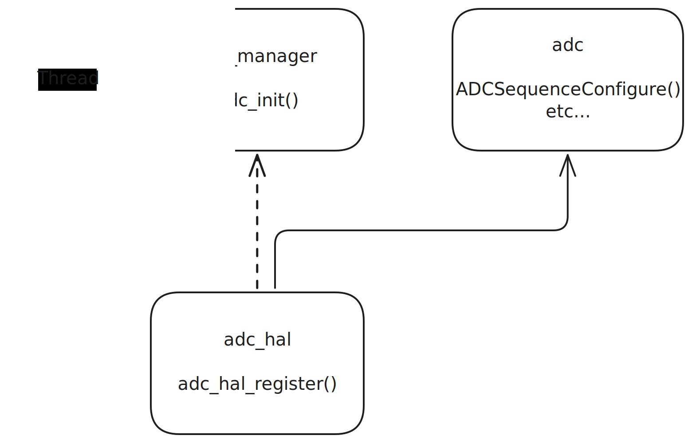
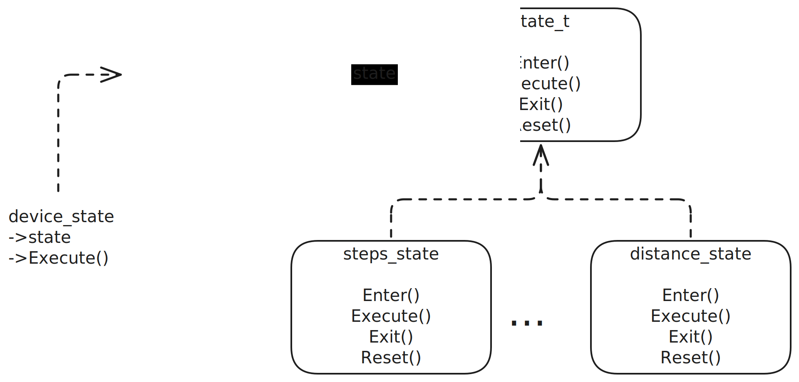
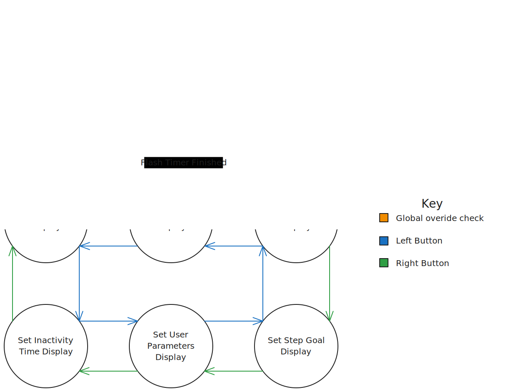

# Architecture Justification
This document serves to justify the design decisions made in architecture of the fitness monitor version two. Due to the use of an RTOS, the high level design is a micro-kernel architecture. This is implemented by having separate application tasks that run concurrently. The RTOS implementation is outlined and justified in [rtos-implementation](RTOS-implementation.md). Within each application task, behaviour is implemented using a ports and adapter architecture.

## Ports and Adapters
Version one handled task timing and high-level behaviour in the main loop. This is not good software design practice because it makes it difficult to implement new functionality without refactoring existing code. To improve this, these functionalities have been decoupled. The use of an RTOS handles the timing of tasks. Each task is then implemented as its own port with various adapters to the hardware. There are several advantages to this implementation. First, this architecture decouples the task into several modules each with a single responsibility. This means the application is more maintainable, with functionality encapsulated. It also allows for automated unit testing to preserve design functionality when making changes. The second advantage is that the level of abstraction within each task is consistent. This shifts hardware-level operation away from the high level behaviour, allowing for either the high or low level modules to be changed independently.

## Adapter Design Pattern 
Interaction with each hardware peripheral has been implemented using a Hardware Abstraction Layer (HAL). These are implemented using the adapter design pattern to hide the device-specific behaviour within a device-specific module. This achieves dependency inversion where each tiva HAL implements the interface defined in the generic HAL header file. This maximises forwards-compatiability because the fitness monitor could be ported to different hardware by only changing the HAL implementations. The same interface can also be used across multiple features. This also ensures that hardware interaction is abstracted from the main application. These HALs can be easily mocked to streamline automated testing. One of the HAL implementations, for the adc, is shown below.

## State Design Pattern
The state design pattern has been implemented for device state control and execution. This pattern defines a generic state interface, [state_t](../target/src/device_states/state.h), and a device context to hold the current state, [device_state_t](../target/src/device_state_handler.h). Each device state is a specific implementation of this interface. This adheres to the open-closed and Liskov substitution principles as the specific state behaviour is abstracted from the state machine. This allows for new states to be implemented without changing the state machine itself. It also achieves interface segregation as each state is independent of the others. An outline of this pattern implementation is shown below.

To summarise, state_t defines an interface for a state. This has four functions:
- `Enter()` - Called once upon state entry to perform any setup.
- `Execute()` - Called periodically if the state is active to perform state behaviour.
- `Exit()` - Called once on state end to clean up context before transitioning to new state.
- `Reset()` - Called asynchronously on user input to reset all states manually.

The device task only interacts with the current task stored in the `device_state_t` context. All interaction with this is encapsulated with the module [device_state_handler](../target/src/device_state_handler.c), including registering specific states. This streamlines the process for adding new states. To create a new state:
1. Create a source file in [device_states](../target/src/device_states/) defining an implementation of the source file.
2. Enumerate the state in the required location with an ID in `stateID_t` in [device_state_handler](../target/src/device_state_handler.h).
3. Add the registration of the state to the array in `device_state_init` within [device_state_handler](../target/src/device_state_handler.c).

## State Implementation
In the version two fitness monitor there are nine possible device states. These implement the version one functionality and a number of additional features described in [fitness-monitor-v2-features](./fitness-monitor-v2-features.md). A summary of these states and the transitions between them is outlined below.
