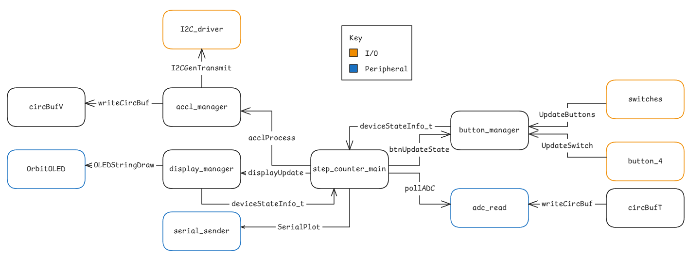

# Fitness Monitor v1 Overview
`Group 1: Isaac Cone (ico29), Jack Duignan (jdu80), Daniel Hawes (dha144)`

## Structure
The version one firmware is modular, but has inconsistent levels of abstraction. There are several modules with reused functionality and a circular dependency. It does not exhibit clean code practices and so needs to be improved. The structural dependencies are summarised below.

## Architecture
Version one uses a timer based scheduler to handle timing constraints. There is no check for task overrun and tasks do not run concurrently. The system is timed by the systick interrupt configured to `10 [kHz]`. The different tasks are then run at different frequencies, namely `75 [Hz]` for the GPIO and ADC, `200 [Hz]` for the accelerometer, `5 [Hz]` for the display, and, if debugging, `100 [Hz]` for the serial print.

## Evaluation
The version one firmware attempts to use modules to separate functionality, improving its modifiability and readability. This is not implemented well, as modules do not encapsulate functionality and sometimes share behaviour (e.g. circBufT/V and button4/switches). There also exists a circular dependency with deviceState_t being provided by the main header file. This increases the scope of many modules unnecessarily. The modules could be improved by reducing duplicate functionality, improving naming and reducing global variable scope. These changes would improve modifiability and unit-testability to protect functionality.

The version one architecture does attempt to implement task scheduling tasks to run at different rates. This means that lower priority tasks do not interfere with the high speed calculation required to track the step counting. There is also tick overflow checking to ensure robust timing. The main issue with this timer based scheduler is that it does not check for task execution time overrun. This means that deadlines for high priority tasks could be missed due to a lower priority task taking longer than its period to run. The timing and behaviour of the states is also spread out across both the main file and modules. This means that it is difficult to split tasks into smaller sections to ensure deadlines are met.
