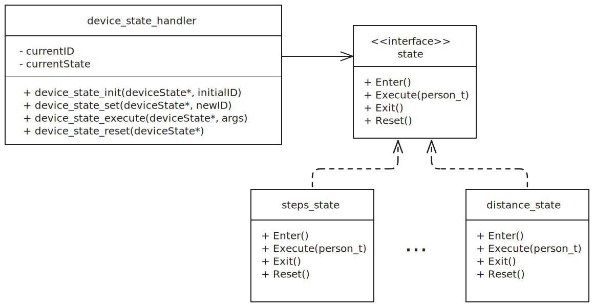

# Fitness Monitor v2 Overview

This file outlines the structure and architecture of the version two fitness monitor project. It serves to give a high-level view of the project in its current state and highlight key differences from the version one, summarised in [fitness-monitor-v1-overview](fitness-monitor-v1-overview.md). There are several changes that have been made in line with concepts presented in ENCE464 lectures in order to improve the project.

## Structure
The version two fitness monitor implements a significantly refined structure. The main practical reason that this refactor was required was to port the fitness monitor to use a micro-kernel architecture as required for this project. This implementation is detailed in [rtos-implementation](RTOS-implementation.md). Overall, the new structure aims to keep consistent levels of abstraction, encapsulate functionality where appropriate, and avoid hardware dependence. This is achieved by using the ports-and-adapters architecture pattern within each of the application threads.The key dependencies are outlined in Figure 1.

Figure 1: Dependency tree for fitness monitor v2 showing main file dependencies.

### Modules
A brief description of mentioned modules is given below.
- `fitness_monitor_main` - Handles the intialisation of the system, creation of RTOS threads, and entry into the RTOS.
    - `step_counter_manager` - Implements the thread for counting steps.
        - `step_counter` - Defines a generic step counter interface
        - `step_counter_analog` - Defines a specific step counter algorithm inspired by Analog Devices.
        - `accl_handler` - Handles high level interactions with an accelerometer to read, store, and filter acceleration data.
            - `accl_hal` - Defines an abstract interface for an accelerometer, implemented for tiva by `accl_hal_tiva`.
            - `i2c_hal` - Defines an abstract interface for the i2c interface, implemented for tiva by `i2c_hal_tiva`.
    - `step_counter_comms` - Encapsulates interactions with a mutex-locked variable to track steps.
    - `device_manager` - Implements the thread for handling the state of the device.
        - `device_state_handler` - Encapsulates interactions with the current device state.
            - `state` - Defines a generic state interface, implemented by several state implementation files located in [device_states](../target/src/device_states/)
            - `display_hal` - Defines a generic interface for a display, implemented for the Orbit addon by `display_hal_tiva`.
    - `pot_manager` - Implements the thread for reading the potentiometer
        - `adc_handler` - Handles high level interactions with an adc to read, store, and filter adc data.
            - `adc_hal` - Defines an abstract interface for an adc, implemented for the tiva by `adc_hal_tiva`.
    - `pot_comms` - Encapsulates interactions with a mutex-locked variable to trac the adc reading.
    - `input_manager` - Implements the thread for detecting button and switch inputs.
        - `input_hal` - Defines a generic interface for inputs, implemented for the tiva by `input_hal_tiva`
    - `input_comms` - Encapsulates interactions with a message queue to expose detected inputs.
    - `clock_hal` - Defines an abstract interface for a system clock, implemented for the tiva by `clock_hal_tiva`.

### Justification
#### Ports and Adapters and the Adapter Design Pattern
One of the key weaknesses of the version one fitness monitor was that the abstraction was inconsistent and the design was rigid. This meant that any changes to functionality were confusing and frustrating to implement. This is because of the close coupling of modules.

To resolve this, the step counter, potentiometer, and inputs threads are implemented using the ports and adapters architeture. This aims to achieve dependency inversion by keeping the tivaware specific hardware references abstracted from the main application behaviour. An example of this is shown in Figure 2. In this instance, the thread wants to initialise the adc peripheral. Instead of directly calling the required set of functions to do so, the thread interacts with the adc_hal. This defines generic functions for interacting with any adc peripheral. A specific HAL for the tiva implements this interface, and calls the required tivaware library functions.

Figure 2: Adapter design pattern implementation for the fitness monitor adc hal.

By implementing all of the hardware interactions with this same architecture, several benefits are realised. Firstly, the dependency inversion of the HALs means that the fitness monitor is kept completely abstracted from the tiva hardware. This maximises forwards compatability, as the design could theoretically be ported to different hardware and only require replacement of the tiva HAL implementations. The second benefit is that it streamlines the level of abstraction across the project. By forcing hardware to be accessed through a HAL it ensures that there are no hardware-specific function calls in functions at higher levels.

#### State Design Pattern
As mentioned, the version one fitness monitor was impossible to add features to without refactoring. The reason for this is that the device state transitions, state behaviour, and task timing were all coupled in the step_counter_main file. All three of these are crucial to any functionality, but have very different purposes. To streamline the addition of new device states, the state design pattern was implemented. A UML outline of this pattern implementation is shown in Figure 3. 

Figure 3: Class diagram showing state design pattern implementation.

To summarise, state_t defines an interface for a state. This has four functions:
- `Enter()` - Called once upon state entry to perform any setup.
- `Execute()` - Called periodically if the state is active to perform state behaviour.
- `Exit()` - Called once on state end to clean up context before transitioning to new state.
- `Reset()` - Called asynchronously on user input to reset all states manually.

The device interacts only with the current state stored in device_state_t. This handles interaction with the currently active state. Specific states are then implemented to define behaviour. The purpose of this design pattern is to keep the specific behaviour abstracted from the device. This allows for seamless additions of new states by creating new implementations of the state interface. To create a new state, the source file should be created in [device_states](../target/src/device_states/) and included in [device_state_handler](../target/src/device_state_handler.c) to be registered in the appropriate position.

Figure 4: State machine diagram showing 